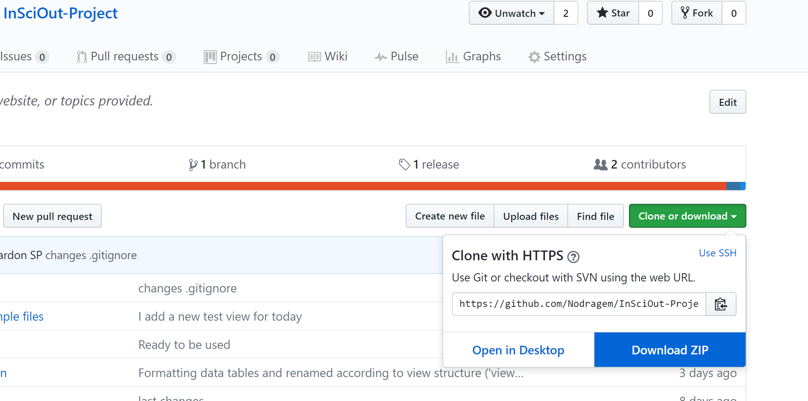
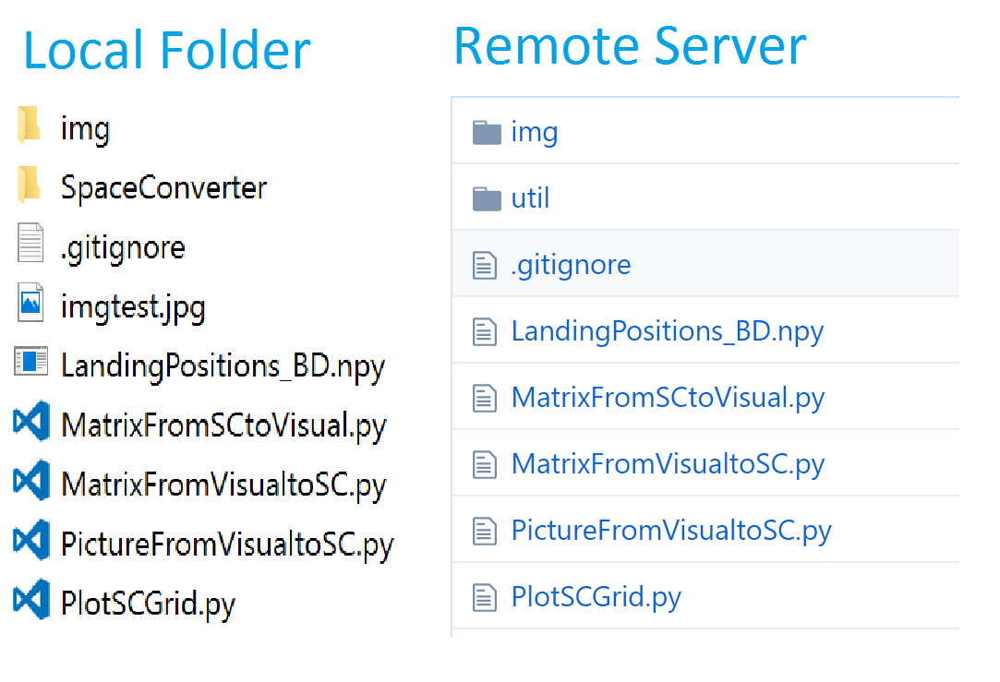

```{r setup, include=FALSE}
knitr::opts_chunk$set(echo = TRUE)
```

# Play with the Data

In order to play with the data, you can simply download the zip file on the github repository ([here](https://github.com/Nodragem/InSciOut-Project)).



> **!!! Doing so, all the changes that you will make won't affect the Github reposity !!!**
>
> To participate officially to InSciout, you need to be able to push your changes to the remote server (i.e., the Github repository).
> This process is explained in a later section, for now we will overview how the project is structured and how the different files and folder are meant to be used.

# Participate to InSciOut project

## Project Organisation

There are different folders in the project and this is how they are meant to be used:

- **analyses**: this were you are going to store your R/SAS/SPSS analyses and plots of the data your extracted in *./database/CSVTables*
- **database**: this is where the insciout database `InSciOut.sqlite3` stays, it also contains the following folders:

    * **ViewQueries**: this is where you are storing a backup version of the sql code you used to created views in the database `InSciOut.sqlite3`, they will be named following the pattern: View001.sql, View002.sql, etc. Note that views are virtual tables that you can create from the information available from the database. Learn more about Views [here](./Views_Reference.html).
    * **CSVTables**: this is where you are exporting a CSV version of the views you created. This can be useful to analyse this views with R/SAS/SPSS or other software.
  
- **documentation**: this folder already contains documentations on the Project, the DataBase organisation and some tutorials to create your own Views. If you created a new View, you will add its documentation in the [Views Reference](./Views_Reference.Rmd). Please put any pictures that you used in the folder `img`.
- **rawdata**: this is where the excel spreadsheets that are used to create the database are stored. These excel spreadsheets were manually filled by our team, then a python program extracted their data to create a database organised with entries and columns. If you want to had an excel spreadsheet, it needs to be under a folder. Each folder represents a project/category. The parent folder's name of an excel spreadsheet will be included in the reference number of the extracted entries when exported to the database. Learn more about the Database organisation [here](./DataBase Organisatin.html).

## Create your own View and CSV Tables

You can find tutorials that reviews the database organisation and how to create your own View/CSV Tables:
 
 - in R [here](./tutorials/InSciOut_Tutorial_R_sqlite.html)
 - in SQL [here](./tutorials/InSciOut_Tutorial_SQL_sqlite.html)
 
Note that if you want to make an official contribution, you will need to use the SQL method (which is also the simplest). Note that the SQL template to extract data from the database (using Views) is very accessible and easy to learn.

> **Rules and Conventions:**
> 
> - save a backup version of the SQL code used to created your View in `./database/ViewQueries`
> - export the CSV table version of your Views in `./database/CSVTables`
>	- name your views something like `view001` rather than `JAPR_language_73`
> - when your add a view to the database, please add its documentation in [./documentation/Views_Reference.Rmd](./Views_Reference.Rmd).
>	- use short variable name such as `T1` instead of `tmpT1` when making a temporary table with `WITH`
>	- keep the main comments that explain `WITH`, `SELECT`, `FROM` (you don't know which sql files the new user will be openning first)
>	- organise the header comment in a pretty way, don't overload the comments, you can explain your code further in the `Views Reference`.


## Make official changes to the Project:

### What is Github ?

A Github repository is similar to a Google Drive or Dropbox folder -- it reflects a folder on your local machine. However, Github does not synchronise your files automatically, you need to explicitly upload your local folder (i.e. tu push) on the remote repository (i.e. the Github repository). Then each time you make changes to your local folder, you will need to push explicity the change made in the local folder to the remote repository. 



This may seems cumbersome but Github is made to collaborate on writing text files (e.g. source code). With Google Drive, you could modify a file that one of your colleagues modified too, without noticing. Google drive may chose to overwrite the change of your colleague or to make two files. Github solves the problem.

### Installing Git/SourceTree

These actions need to be perform only once to get the InSciOut repository on you PC.

You need to:

  - get an account at [Github](github.com),
  - install Git from [here](https://git-scm.com),
  - install SourceTree from [here](https://www.sourcetreeapp.com)

In Source Tree, you need to add your GitHub account. 
This can be done during the installation, as describe [here](https://confluence.atlassian.com/get-started-with-sourcetree/install-sourcetree-847359094.html) or after you run SourceTree, as described [here](https://confluence.atlassian.com/get-started-with-sourcetree/connect-your-bitbucket-or-github-account-847359096.html).

### Versionning with Github

```{r, echo=FALSE, message=FALSE, warning=FALSE}
library(DiagrammeR)
grViz("
digraph example {
  rankdir=LR;
  node [shape=circle, fontname=Helvetica]
  A [label='v0.0']; B [label='v0.1']; 
  C[label='v0.2', style = invis]; D[label='v0.3', style = invis]
    
  A -> B [label= 'commit', fontname=Helvetica];
  B -> C [style='invis'];
  C -> D [style='invis'];
}
", height = 200)
```


Github is named after Git, which is a version control software. Basically, it allows you to make a snapshot of your local folder at any time you want (i.e. to commit a change). By commiting your changes each time you did a meaningful progress, you can track your changes, come back to an earlier version, take a file from an earlier snapshot, etc... Such a folder that is tracked by Git is named a Git repository; each snapshot is a "version" of the repository.

```{r, echo=FALSE, message=FALSE, warning=FALSE}
library(DiagrammeR)
grViz("
digraph example {
  rankdir=LR;
  node [shape=circle, fontname=Helvetica]
  A [label='v0.0']; B [label='v0.1']; 
  C[label='v0.2']; D[label='v0.3']
    
  A -> B [label= 'commit', fontname=Helvetica];
  B -> C [label= 'commit', fontname=Helvetica];
  C -> D [label= 'commit', fontname=Helvetica];
}
", height = 200)
```

Github is made to work with a Git repository. When we first create the InSciOut folder on our machine, we initialised Git in our local folder to make the InSciOut folder a 'Git repository'. Then, we upload the Git repository (containing the list of all our snapshots made with Git) to Github. From then, each time we commit a change (i.e. snapshot), we can push it to the remote server (i.e. upload it to Github).

Initialization:

```{r, echo=FALSE, message=FALSE, warning=FALSE}
library(DiagrammeR)
grViz("
digraph example {
  rankdir=LR;
  node [shape=circle, fontname=Helvetica]
  A [label='v0.0']; B [label='v0.1', style = invis]; 
  C[label='v0.2', style = invis]; D[label='v0.3', style = invis]
  node [shape=box, fontname=Helvetica]
  Ar [label='v0.0']; Br [label='v0.1', style = invis]; 
  Cr[label='v0.2', style = invis]; Dr[label='v0.3', style = invis]
  subgraph cluster0 { 
  # local repo
  A -> B [style = invis,label= 'commit', fontname=Helvetica];
  B -> C [style='invis'];
  C -> D [style='invis'];
  label = 'local machine (Git Repo)';
  style=filled;
	color=PeachPuff;
  labeljust='l';
  }
  subgraph cluster1 {
  # remote repo
  Ar -> Br [style = invis, label= 'commit', fontname=Helvetica];
  Br -> Cr [style='invis'];
  Cr -> Dr [style='invis'];
  label = 'remote server (GitHub Repo)';
  style=filled;
	color=AliceBlue;
  labeljust='l';
  }

  
}
", height = 200)
```

First commit:
```{r, echo=FALSE, message=FALSE, warning=FALSE}
library(DiagrammeR)
grViz("
digraph example {
  rankdir=LR;
  node [shape=circle, fontname=Helvetica]
  A [label='v0.0']; B [label='v0.1']; 
  C[label='v0.2', style = invis]; D[label='v0.3', style = invis]
  node [shape=box, fontname=Helvetica]
  Ar [label='v0.0']; Br [label='v0.1', style = invis]; 
  Cr[label='v0.2', style = invis]; Dr[label='v0.3', style = invis]
  subgraph cluster0 { 
  # local repo
  A -> B [label= 'commit', fontname=Helvetica];
  B -> C [style='invis'];
  C -> D [style='invis'];
  label = 'local machine (Git Repo)';
  style=filled;
	color=PeachPuff;
  labeljust='l';
  }
  subgraph cluster1 {
  # remote repo
  Ar -> Br [label= 'commit', fontname=Helvetica, style = invis];
  Br -> Cr [style='invis'];
  Cr -> Dr [style='invis'];
  label = 'remote server (GitHub Repo)';
  style=filled;
	color=AliceBlue;
  labeljust='l';
  }

  
}
", height = 200)
```

First Push:

```{r, echo=FALSE, message=FALSE, warning=FALSE}
library(DiagrammeR)
grViz("
digraph example {
  rankdir=LR;
  node [shape=circle, fontname=Helvetica]
  A [label='v0.0']; B [label='v0.1']; 
  C[label='v0.2', style = invis]; D[label='v0.3', style = invis]
  node [shape=box, fontname=Helvetica]
  Ar [label='v0.0']; Br [label='v0.1']; 
  Cr[label='v0.2', style = invis]; Dr[label='v0.3', style = invis]
  subgraph cluster0 { 
  # local repo
  A -> B ;
  B -> C [style='invis'];
  C -> D [style='invis'];
  label = ' ';
  style=filled;
	color=PeachPuff;
  labeljust='l';
  }
  subgraph cluster1 {
  # remote repo
  Ar -> Br ;
  Br -> Cr [style='invis'];
  Cr -> Dr [style='invis'];
  label = 'remote server (GitHub Repo)';
  style=filled;
	color=AliceBlue;
  labeljust='l';
  }

  B -> Br [label='push', fontname=Helvetica, arrowsize=1, penwidth=10, constraint=false, color=OrangeRed, labeldistance = 2, labelfontcolor= OrangeRed]
  
}
", height = 200)
```

Second commit:
```{r, echo=FALSE, message=FALSE, warning=FALSE}
grViz("
digraph example {
  rankdir=LR;
  node [shape=circle, fontname=Helvetica]
  A [label='v0.0']; B [label='v0.1']; 
  C[label='v0.2']; D[label='v0.3', style = invis]
  node [shape=box, fontname=Helvetica]
  Ar [label='v0.0']; Br [label='v0.1']; 
  Cr[label='v0.2', style = invis]; Dr[label='v0.3', style = invis]
  subgraph cluster0 { 
  # local repo
  A -> B ;
  B -> C [label='commit'];
  C -> D [style='invis'];
  label = 'local machine (Git Repo)';
  style=filled;
	color=PeachPuff;
  labeljust='l';
  }
  subgraph cluster1 {
  # remote repo
  Ar -> Br ;
  Br -> Cr [style='invis'];
  Cr -> Dr [style='invis'];
  label = 'remote server (GitHub Repo)';
  style=filled;
	color=AliceBlue;
  labeljust='l';
  }

  
}
", height = 200)
```

Second Push:
```{r, echo=FALSE, message=FALSE, warning=FALSE}
grViz("
digraph example {
  rankdir=LR;
  node [shape=circle, fontname=Helvetica]
  A [label='v0.0']; B [label='v0.1']; 
  C[label='v0.2']; D[label='v0.3', style = invis]
  node [shape=box, fontname=Helvetica]
  Ar [label='v0.0']; Br [label='v0.1']; 
  Cr[label='v0.2']; Dr[label='v0.3', style = invis]
  subgraph cluster0 { 
  # local repo
  A -> B ;
  B -> C ;
  C -> D [style='invis'];
  label = 'local machine (Git Repo)';
  style=filled;
	color=PeachPuff;
  labeljust='l';
  }
  subgraph cluster1 {
  # remote repo
  Ar -> Br ;
  Br -> Cr ;
  Cr -> Dr [style='invis'];
  label = 'remote server (GitHub Repo)';
  style=filled;
	color=AliceBlue;
  labeljust='l';
  }

    C -> Cr [label='push', fontname=Helvetica, arrowsize=1, penwidth=10, constraint=false, color=OrangeRed, labeldistance = 2, labelfontcolor= OrangeRed]
  
}
", height = 200)
```

### Merge Conflicts
```{r, echo=FALSE, message=FALSE, warning=FALSE}
library(DiagrammeR)
grViz("
digraph example {
  rankdir=LR;
  node [shape=circle, fontname=Helvetica]
  A [label='v0.0']; B [label='v0.1']; 
  C1[label='v0.2?']; 
  C2[label='v0.2?'];
  C[label='v0.2'];
  D[label='v0.3']
    
  A -> B;
  B -> C1 [label= 'Rachel commit', fontname=Helvetica];
  B -> C2 [label= 'Luke commit', fontname=Helvetica];
  C1 -> C [label= 'merge', fontname=Helvetica];
  C2 -> C [label= 'merge', fontname=Helvetica];
  C -> D;
}
", height = 200)
```

Because Github works with Git, it can manage conflicts when a file is modified by several persons. It happends that several persons start to make changes from the same version of the repository. While you commit you changes, Git will read the different files in the repository and detect the changes made to the previous version. If nobody changed the same part/lines of the previous version, Git will merge the change automatically. If two persons changed the same part/lines of the previous version, then Github will raise a merge conflict. In this case, the users will need to agree on what to keep, and re-commit the changes to Git.


### More on Collaborative Workflow

While collaborating, you will be using this workflow (Centralized Workflow):
https://www.atlassian.com/git/tutorials/comparing-workflows#centralized-workflow

Basically you need to check the box [rebase] in preference of SourceTree.
Then each times you want to share your changes:
- commit (if not already)
- pull
- [solve conflict if any]
- push

Note that you can commit locally any many times as you want before to share your changes.


